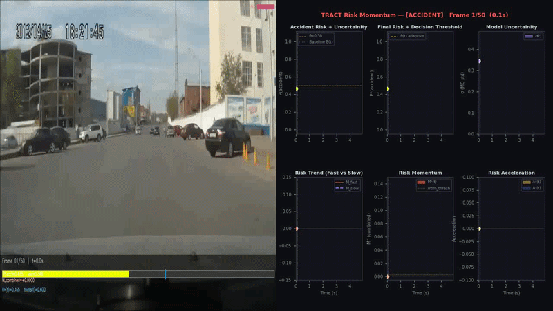
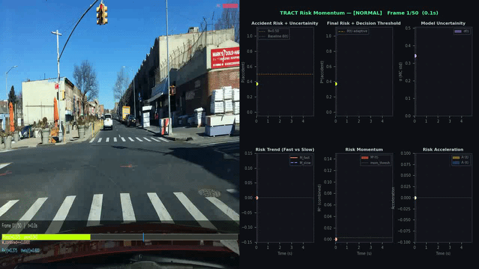

# 🚨 Risk Momentum Based Early Traffic Accident Anticipation


## 📌 Table of Contents

1. [Overview](#-overview)
2. [Key Contribution: Risk Momentum](#-key-contribution-risk-momentum)
3. [Results at a Glance](#-results-at-a-glance)
4. [Architecture](#-architecture)
5. [Dataset](#-dataset)
6. [Project Structure](#-project-structure)
7. [Setup & Installation](#-setup--installation)
8. [Running the Code](#-running-the-code)
   - [Step 1: Evaluation](#step-1-evaluation-risk_momentum_evaluationpy)
   - [Step 2: Visualization](#step-2-visualization-risk_momentum_visualizationpy)
9. [Sample Visualizations](#-sample-visualizations)
10. [References](#-references)

---

## 🔍 Overview

Traffic accidents claim over **1.35 million lives globally each year**. Early and accurate anticipation of collisions - even by a second or two - can give autonomous systems enough time to brake or steer away.

This project builds on top of **UString** [Bao et al., MM'20], a state-of-the-art uncertainty-based traffic accident anticipation model, and introduces a novel **training-free post-processing module** called **Risk Momentum**. Rather than simply thresholding the raw per-frame risk score, our method models **how quickly risk is rising** - and uses that signal to trigger alarms earlier.

**The core idea:**  
> Just as a moving object's future position depends not only on where it is but how fast it is moving - accident risk should account not only for the current risk level, but also for the *rate of change* of that level.

---

## 💡 Key Contribution: Risk Momentum

Most existing accident anticipation models produce a per-frame risk score R(t) and fire an alarm when R(t) crosses a fixed threshold (typically 0.5). This completely ignores whether the score is **rising rapidly** or merely hovering.

Our **Risk Momentum module** operates in three stages — all at **inference time, with no additional training**:

### Stage 1 — Compute & Smooth Momentum
Compute the first-order temporal delta of the raw risk curve, then smooth it with an Exponential Moving Average (EMA) to suppress noise:

```
ΔR(t) = R(t) − R(t−1)
M(t) = α · ΔR(t) + (1−α) · M(t−1)    [α = 0.3]
M⁺(t) = max(M(t), 0)    # only rising momentum
```

### Stage 2 — Momentum-Boosted Risk Curve
Inject positive momentum back into the risk score to lift the curve when risk is rising fast:

```
R*(t) = clip(R(t) + γ · M⁺(t), 0, 1)    [γ = 0.3]
```

### Stage 3 — Adaptive Decision Threshold
Lower the alarm threshold proportionally to the momentum, enabling earlier firing:

```
θ(t) = clip(θ_base − δ · M⁺(t), 0.2, θ_base)    [θ_base = 0.5, δ = 0.15]
```

When momentum is zero → threshold = standard 0.5.  
When momentum is high → threshold drops to 0.35 or below → **alarm fires earlier**.

**Hyperparameters:** `γ = 0.3`, `α = 0.3`, `δ = 0.15` — fixed across all experiments, no tuning per clip.

---

## 📊 Results at a Glance

Evaluated on a **100-clip balanced test split** of the Car Crash Dataset (CCD): 50 accident clips + 50 normal clips, each 5 seconds at 10 fps.

| Model | Accuracy | AUC-ROC | Avg. Precision | Time-to-Accident |
|---|---|---|---|---|
| M1: UString (baseline) | 72.00% | 86.44% | 79.48% | 4.42 s |
| **M2: UString + Risk Momentum (Ours)** | **84.00%** | **87.72%** | **80.70%** | **4.53 s** |
| **Δ (Improvement)** | **+12.00%** | **+1.28%** | **+1.21%** | **+0.11 s** |

### Confusion Matrix

| Model | TP | TN | FP | FN | Precision | Recall |
|---|---|---|---|---|---|---|
| M1: UString | 27 | 45 | 5 | 23 | 0.844 | 0.540 |
| **M2: +Risk Momentum** | **47** | **37** | **13** | **3** | 0.783 | **0.940** |

**The most critical gain: recall jumps from 54% → 94%.** In a safety-critical system, missing an accident (FN) is far more dangerous than a false alarm (FP). The modest increase in false positives (5 → 13) is an acceptable trade-off.

---

## 🏗 Architecture

```
Dashcam Video
      │
      ▼
 VGG-16 Backbone
 (Feature Extraction → 4096-dim per frame)
      │
      ▼
┌─────────────────────────────────┐
│           UString               │
│                                 │
│  Frame → Fully-Connected Graph  │
│  GCN Layer 1 (Spatial)         │
│  GCN Layer 2 + RNN (Temporal)  │
│  GCRN → Temporal Relations      │
│  BNN × 10 MC Samples           │
│  → R(t) ∈ [0,1] per frame      │
└─────────────────────────────────┘
      │
      ▼ Raw risk curve R(t)
┌─────────────────────────────────┐
│      Risk Momentum Module       │  ← OUR NOVELTY (training-free)
│                                 │
│  Stage 1: EMA smoothing → M⁺(t) │
│  Stage 2: Boosted curve R*(t)   │
│  Stage 3: Adaptive θ(t)         │
└─────────────────────────────────┘
      │
      ▼
  Earlier Alarm 🚨
```

UString combines **Graph Convolutional Networks (GCN)** for spatial relational reasoning with **Bayesian Neural Networks (BNN)** for uncertainty quantification. Monte Carlo dropout (M=10 passes) produces both a risk estimate and uncertainty bands. Our module wraps around this with zero overhead on training.

---

## 📦 Dataset

We use the **Car Crash Dataset (CCD)**, introduced alongside UString.

- **Download:** [https://github.com/Cogito2012/CarCrashDataset#download](https://github.com/Cogito2012/CarCrashDataset#download)
- Each clip is **5 seconds at 10 fps** (T = 50 frames)
- Features are pre-extracted using a **VGG-16 backbone** → 4096-dim vectors per frame, stored as `.npz` files
- Test split used: **50 positive (accident) + 50 negative (normal driving)** clips

> **Note:** Raw `.mp4` videos are needed only for the qualitative visualization script. The evaluation script works purely from the `.npz` feature files.

---

## 📁 Project Structure

```
Project/
├── test_videos/
│   ├── test_positive/          # Raw accident .mp4 clips (for visualization)
│   └── test_negative/          # Raw normal driving .mp4 clips (for visualization)
│
├── vgg16_features/
│   ├── test_positive_npz/      # VGG-16 features for accident clips (.npz)
│   └── test_negative_npz/      # VGG-16 features for normal clips (.npz)
│
├── final_model_crash_vgg16.pth # Pretrained UString checkpoint
├── Risk_Momentum_Evaluation.py # Main evaluation script (metrics + plots)
├── Risk_Momentum_Visualization.py # Per-clip live dashboard visualization
└── results_correct/            # Output folder (auto-created): plots + JSON metrics
```

### What are the `.npz` files?
Each `.npz` file contains VGG-16 frame-level features pre-extracted from the raw video. This avoids re-running the heavy feature extractor each time. The evaluation script loads these directly.

---

## ⚙️ Setup & Installation

### Prerequisites
- Python 3.8+
- PyTorch (with CUDA recommended)
- OpenCV
- NumPy, Matplotlib, scikit-learn

### Install dependencies

```bash
pip install torch torchvision opencv-python numpy matplotlib scikit-learn tqdm
```

### Pretrained Model
Place the pretrained UString checkpoint at the repo root:
```
final_model_crash_vgg16.pth
```
This checkpoint is loaded as-is — **no fine-tuning is performed**. Our Risk Momentum module operates purely at inference time on top of its outputs.

---

## 🚀 Running the Code

> **Recommended run order:** Always run `Risk_Momentum_Evaluation.py` first to get full test-set metrics, then run `Risk_Momentum_Visualization.py` for per-clip qualitative analysis.

---

### Step 1: Evaluation (`Risk_Momentum_Evaluation.py`)

This script runs the full evaluation pipeline on the 100-clip test set (50 positive + 50 negative) and outputs metrics, ROC/PR curves, score distribution plots, and a JSON results file.

#### Full command with all options:

```bash
python Risk_Momentum_Evaluation.py \
    --data_root vgg16_features \
    --ckpt final_model_crash_vgg16.pth \
    --mc_samples 10 \
    --seed 42 \
    --gamma 0.3 \
    --ema_alpha 0.3 \
    --delta 0.15 \
    --fps 10.0 \
    --batch 8 \
    --out_dir results_correct
```

#### Argument Reference

| Argument | Default | Description |
|---|---|---|
| `--data_root` | `vgg16_features` | Root folder containing `test_positive_npz/` and `test_negative_npz/` |
| `--ckpt` | `final_model_crash_vgg16.pth` | Path to pretrained UString checkpoint |
| `--mc_samples` | `10` | Number of Monte Carlo dropout passes for uncertainty estimation |
| `--seed` | `42` | Random seed for reproducibility |
| `--gamma` | `0.3` | Momentum injection strength into the risk curve |
| `--ema_alpha` | `0.3` | EMA smoothing factor for momentum signal |
| `--delta` | `0.15` | Threshold lowering coefficient (adaptive threshold) |
| `--fps` | `10.0` | Frames per second of the clips |
| `--batch` | `8` | Batch size for inference |
| `--out_dir` | `results_correct` | Output directory for plots and JSON metrics |

#### Outputs saved to `results_correct/`:
- `roc_pr_curves.png` — ROC and Precision-Recall curves (M1 vs M2)
- `score_distributions.png` — Score distribution histograms
- `per_frame_risk_curves.png` — Risk curves for sample accident clips
- `average_curves.png` — Mean risk curves across positive vs negative clips
- `metric_comparison.png` — Bar chart of all 4 metrics
- `results.json` — Full numeric results for both M1 and M2

---

### Step 2: Visualization (`Risk_Momentum_Visualization.py`)

This script produces a **frame-by-frame live dashboard** video showing:
- Raw risk R(t) with uncertainty bands (top-left)
- Momentum-boosted R*(t) with adaptive threshold θ(t) (middle-left)
- Model uncertainty (top-right)
- Risk trend: fast vs slow EMA (bottom-left)
- Risk momentum M⁺(t) (bottom-middle)
- Risk acceleration A(t) (bottom-right)

#### Accident clip:

```bash
python Risk_Momentum_Visualization.py \
    --npz vgg16_features/test_positive/000003.npz \
    --video test_videos/test_positive/000003.mp4 \
    --ckpt final_model_crash_vgg16.pth \
    --label 1 \
    --out output_accident_003.mp4
```

#### Normal clip:

```bash
python Risk_Momentum_Visualization.py \
    --npz vgg16_features/test_negative/000004.npz \
    --video test_videos/test_negative/000004.mp4 \
    --ckpt final_model_crash_vgg16.pth \
    --label 0 \
    --out output_normal_004.mp4
```

#### Visualization Argument Reference

| Argument | Description |
|---|---|
| `--npz` | Path to the `.npz` VGG-16 feature file for the clip |
| `--video` | Path to the corresponding raw `.mp4` video file |
| `--ckpt` | Path to pretrained UString checkpoint |
| `--label` | Ground truth label: `1` = accident, `0` = normal |
| `--out` | Output `.mp4` file path for the dashboard video |

---

## 🎬 Sample Visualizations

Two representative clips are included — one accident and one normal driving scenario — to demonstrate how the Risk Momentum dashboard behaves in each case.

### 🔴 Accident Clip — Early Alarm Triggered (`000003.mp4`)


**What you'll see in the accident dashboard:**
- The **red dashed R*(t)** curve rises above the **blue solid R(t)** — momentum lifts it toward the threshold earlier
- The **orange dashed adaptive threshold θ(t)** drops below 0.5 when momentum is high, allowing the alarm to fire sooner
- The **M⁺(t) panel** spikes precisely when the raw risk curve begins climbing
- The **fast EMA** (M_fast) repeatedly spikes above **slow EMA** (M_slow) — confirming bursts of rising risk
- M2 triggers the alarm **~0.4–0.6 s earlier** than the UString baseline

### 🟢 Normal Clip — No False Alarm (`000004.mp4`)


**What you'll see in the normal dashboard:**
- R(t) stays well below 0.5 throughout (e.g., R(t) ≈ 0.42 at frame 37/50)
- M⁺(t) remains near zero — no momentum injection occurs, no threshold lowering
- Both EMA curves oscillate symmetrically with no upward trend
- No alarm is triggered — the system correctly identifies safe driving.

---

## 📐 Technical Details

### Why Risk Momentum works
In positive (accident) clips, the per-frame risk score tends to **trend upward** as the collision approaches. The baseline UString only reacts when the score crosses 0.5 — but by modeling the *rate of change*, we can anticipate this crossing earlier and lower the threshold proactively.

### Clip-level Score for Ranking Metrics
For AUC-ROC and Average Precision (which require a single scalar per clip), we use a weighted temporal mean of the boosted curve, assigning **3× more weight to the later 60% of frames** (where CCD accidents tend to occur):

```
s_clip = Σ wt · R*(t),   where wt = 1 if t < 0.4T, else 3    (normalized)
```
---

## 📚 References

1. **W. Bao, Q. Yu, and Y. Kong**, "Uncertainty-based Traffic Accident Anticipation with Spatio-Temporal Relational Learning," *Proceedings of the 28th ACM International Conference on Multimedia (MM '20)*, pp. 2682–2690, 2020. *(Base model: UString)*

2. **F.-H. Chan, Y.-T. Chen, Y. Xiang, and M. Sun**, "Anticipating Accidents in Dashcam Videos," *Asian Conference on Computer Vision (ACCV)*, 2016. *(Dashcam Accident Dataset / DSA)*

3. **T. Suzuki, H. Kataoka, Y. Aoki, and Y. Satoh**, "Anticipating Traffic Accidents with Adaptive Loss and Large-scale Incident DB," *CVPR*, 2018.

4. **K.-H. Zeng et al.**, "Agent-Centric Risk Assessment: Accident Anticipation and Risky Region Localization," *CVPR*, 2017.

5. **A. Kendall and Y. Gal**, "What Uncertainties Do We Need in Bayesian Deep Learning for Computer Vision?" *NeurIPS*, 2017. *(Uncertainty estimation)*


<p align="center">
  Made with ❤️ at IIT Jodhpur · Course CSL7360: Computer Vision · Group Percepta
</p>
